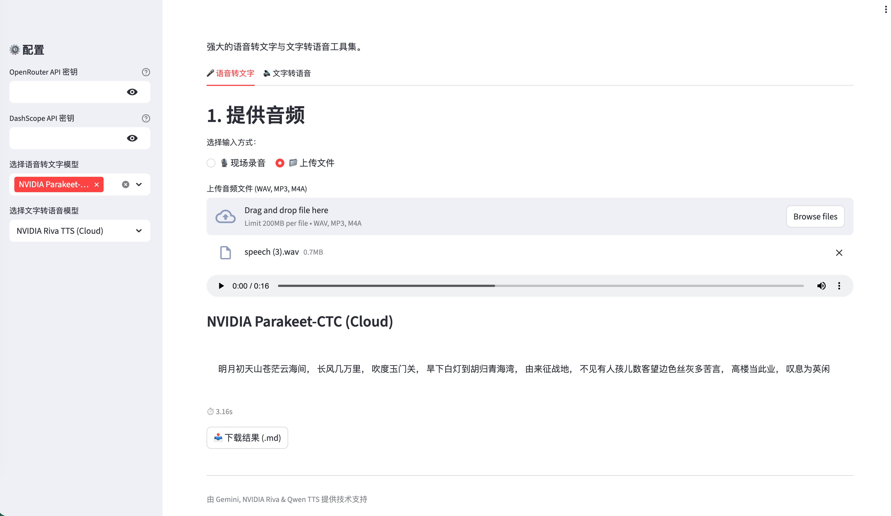
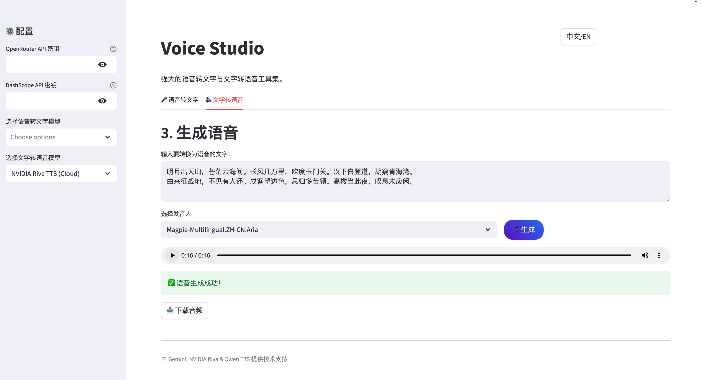

A powerful and elegant Streamlit application that integrates **Automatic Speech Recognition (ASR)** and **Text-to-Speech (TTS)** capabilities. This project provides a convenient platform to compare cutting-edge cloud models from NVIDIA and Google with locally optimized MLX models.

::: {.panel-tabset}

## Speech-to-Text (STT) Interface




## Text-to-Speech (TTS) Interface




:::


## Online Demo

[https://jcwinning-speech-text-model.share.connect.posit.cloud/](https://jcwinning-speech-text-model.share.connect.posit.cloud/)

## ✨ Core Features

### 🎤 Speech-to-Text (STT)
- **Google Gemini 2.5 Flash Lite**: High-speed, accurate cloud transcription provided via OpenRouter.
- **NVIDIA Parakeet-CTC**: Industry-leading ASR performance based on NVIDIA Riva Cloud.
- **Local MLX Models**: Private, local transcription optimized specifically for Apple Silicon.
  - **GLM-ASR-Nano**: Lightweight and efficient.
  - **Whisper-Large-v3-Turbo**: Top-tier, high-precision transcription model.
- **Dual Input Modes**: Supports real-time microphone recording or audio file uploads (WAV, MP3, M4A).
- **Instant Display**: Results are displayed immediately as each model finishes, no need to wait for all models.
- **Auto-Normalization**: Automatically converts audio to 16kHz mono WAV to ensure maximum recognition accuracy.
- **Results Download**: Supports saving transcription results from each model as local `.md` files.

### 🔊 Text-to-Speech (TTS)
- **Qwen TTS (DashScope)**: Natural speech synthesis from Alibaba's Tongyi Qwen, featuring 7 distinct voices.
- **NVIDIA Riva (Magpie)**: Professional-grade multilingual synthesis using the latest Magpie-Multilingual model.
- **Dynamic Voice Selection**: Offers a wide range of speaker options for both Chinese (Mandarin) and English.

## 🚀 Quick Start

### Requirements
- Python 3.10+
- Apple Silicon (for local MLX functionality)
- API Keys:
  - [OpenRouter](https://openrouter.ai/)
  - [NVIDIA NIM](https://build.nvidia.com/)
  - [Alibaba Cloud DashScope](https://dashscope.console.aliyun.com/)

### Installation Steps

1. Clone the repository:
   ```bash
   git clone <repository-url>
   cd ARS
   ```

2. Install dependencies:
   ```bash
   pip install -r requirements.txt
   ```

3. Create a `.env` file in the project root and fill in the keys:
   ```env
   OPENROUTER_API_KEY=your_key_here
   DASHSCOPE_API_KEY=your_key_here
   NVIDIA_API_KEY=your_key_here
   ```

### Running the App
```bash
streamlit run app.py
```

## ☁️ Cloud Deployment
This project is pre-configured for **Streamlit Cloud**:
- Automatically detects the runtime environment and disables local models (MLX) during cloud deployment to ensure system stability.
- API keys can be securely managed via Streamlit's "Secrets" panel.

## 🛠️ Technology Stack
- **Interface**: Streamlit
- **Local Inference**: MLX (optimized for Mac M-series chips)
- **Cloud Services**: NVIDIA Riva, OpenRouter (Gemini), Alibaba Cloud DashScope (Qwen)
- **Audio Processing**: Wave, SoundFile, Streamlit Mic Recorder

---
