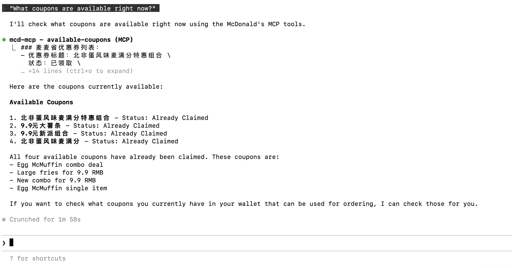
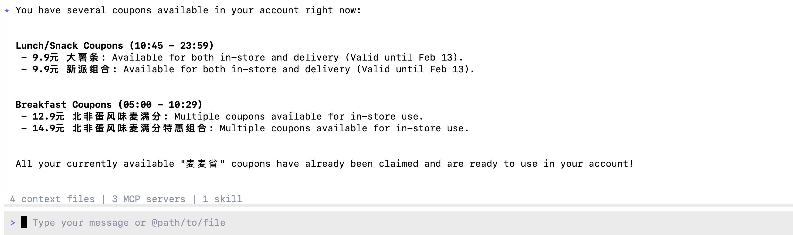
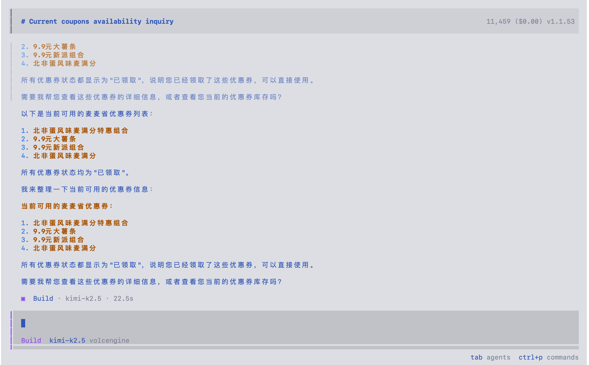
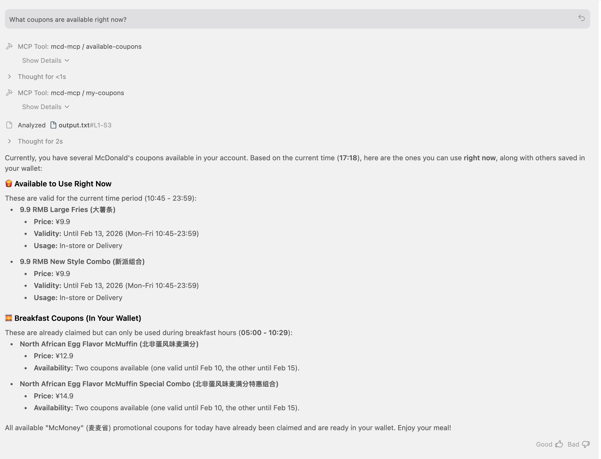
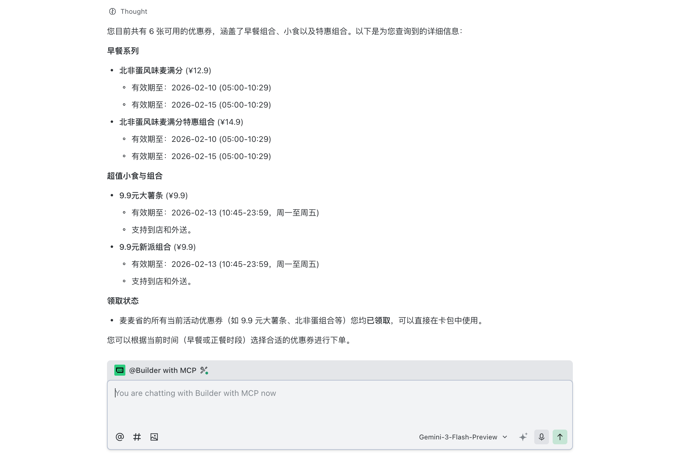

# What is Model Context Protocol (MCP)?

The **Model Context Protocol (MCP)** is an open standard that enables AI
models to seamlessly connect with external data sources and tools.
Developed by Anthropic, it acts as a universal interface—similar to a
USB port—allowing developers to provide LLMs with secure, standardized
access to local files, databases, and third-party APIs without needing
to write custom integrations for every specific service.

By using MCP, AI agents can "reach out" to the real world, performing
tasks like checking inventory, querying nutritional data, or even
claiming coupons—as we'll demonstrate in this tutorial using McDonald's
services.

# Set Up MCP

## Get Keys

1.  LLM model key from https://openrouter.ai

2.  MCD_TOKEN for mcd-mcp access: https://open.mcd.cn/mcp

Save them to `.env`:

```{r}
#| eval: false
OPENROUTER_API_KEY=xxxxxx

MCD_TOKEN=XXXX
```

# Coding with MCP

::: panel-tabset
## In R Code

### Initialize Chat with MCP Tools

```{r}
library(ellmer)
library(mcptools)
library(dotenv)
# Load environment variables
load_dot_env(file = ".env")

# Define model 
model_name <- "x-ai/grok-4.1-fast"
```

```{r}
# Create an ellmer chat object (using OpenRouter as example)
chat <- chat_openrouter(
  system_prompt = "You are a helpful assistant that can interact with McDonald's services. Please be concise",
  api_key = Sys.getenv("OPENROUTER_API_KEY"),
  model = model_name,
  echo = "output"
)

# Create dynamic configuration with token from environment
config_data <- list(
  mcpServers = list(
    "mcd-mcp" = list(
      command = "npx",
      args = c(
        "mcp-remote",
        "https://mcp.mcd.cn/mcp-servers/mcd-mcp",
        "--header",
        paste0("Authorization: Bearer ", Sys.getenv("MCD_TOKEN"))
      )
    )
  )
)

config_file <- tempfile(fileext = ".json")
jsonlite::write_json(config_data, config_file, auto_unbox = TRUE)

# Load MCP tools via the temporary configuration file
mcd_tools <- mcp_tools(config = config_file)

# Register the MCP tools with the chat
chat$set_tools(mcd_tools)
```

### Chat with MCP Integration

Now you can ask questions and the AI will use the McDonald's MCP tools:

```{r}
# Query available coupons
chat$chat("What coupons are available right now?")
```

```{r}
# Auto-claim all coupons
chat$chat("Help me claim all available coupons.")
```


```{r}
# Get nutrition information
chat$chat("Help me design a 1000-calorie meal that includes a sugared cola and costs no more than 30 yuan.")
```

## in Python Code

### Initialize Chat with MCP Tools

```{python}
#| eval: false
import os
import asyncio
from dotenv import load_dotenv
from langchain_mcp_adapters.client import MultiServerMCPClient
from langchain_openai import ChatOpenAI
from langgraph.prebuilt import create_react_agent

# Load environment variables
load_dotenv()

# Define model (using OpenRouter)
model_name = "x-ai/grok-4.1-fast"

# Create the LLM with OpenRouter
llm = ChatOpenAI(
    model=model_name,
    openai_api_key=os.getenv("OPENROUTER_API_KEY"),
    openai_api_base="https://openrouter.ai/api/v1",
    temperature=0
)

# Build the mcp-remote command with authorization header
mcd_token = os.getenv("MCD_TOKEN")
mcp_command_args = [
    "mcp-remote",
    "https://mcp.mcd.cn/mcp-servers/mcd-mcp",
    "--header",
    f"Authorization: Bearer {mcd_token}"
]

# Configure the MCP client
mcp_config = {
    "mcd-mcp": {
        "command": "npx",
        "args": mcp_command_args,
        "transport": "stdio"
    }
}

async def run_mcp_agent(query: str):
    """Run an MCP-enabled agent with the given query."""
    # Create client (no context manager in v0.1.0+)
    client = MultiServerMCPClient(mcp_config)
    
    # Get tools from MCP server (await required)
    tools = await client.get_tools()
    
    # Create a ReAct agent with the tools
    agent = create_react_agent(llm, tools)
    
    # Run the agent
    result = await agent.ainvoke({
        "messages": [
            {"role": "system", "content": "You are a helpful assistant that can interact with McDonald's services. Please be concise."},
            {"role": "user", "content": query}
        ]
    })
    
    # Return the final response
    return result["messages"][-1].content
```

### Chat with MCP Integration

Now you can ask questions and the AI will use the McDonald's MCP tools:

```{python}
#| eval: false
# Query available coupons
asyncio.run(run_mcp_agent("What coupons are available right now?"))
```

```{python}
#| eval: false
# Auto-claim all coupons
asyncio.run(run_mcp_agent("Help me claim all available coupons."))
```

```{python}
#| eval: false
# Check your coupons
asyncio.run(run_mcp_agent("Show me all my current coupons."))
```

```{python}
#| eval: false
# Query campaign calendar
asyncio.run(run_mcp_agent("What exciting activities are happening in the next 15 days?"))
```

```{python}
#| eval: false
# Get nutrition information
asyncio.run(run_mcp_agent("Help me design a 1000-calorie meal that includes a sugared cola and costs no more than 30 yuan."))
```
:::

# Agent with MCP

::: panel-tabset
## Claude Code CLI

Replace "xxx" with your token and add the following setting to the
user-level or project-level config file

### JSON File

```{r}
#| eval: false
{
  "mcpServers": {
    "mcd-mcp": {
      "type": "http",
      "url": "https://mcp.mcd.cn/mcp-servers/mcd-mcp",
      "headers": {
        "Authorization": "Bearer xxx"
      }
    }
  }
}
```

*User-Level Config File*:

\~/.claude.json

*Project-Level Config File*:

your_project/.mcp.json

### Ask: "What coupons are available right now?"

{width="700"}

## Gemini CLI

Replace "xxx" with your token and add the following setting to the
user-level or project-level config file

### JSON File

```{python}
#| eval: false
{
"mcpServers": {
    "mcd-mcp": {
      "url": "https://mcp.mcd.cn/mcp-servers/mcd-mcp",
      "headers": {
        "Authorization": "Bearer xxx"
      }
    }
  } 
} 
```

*User-Level Config*:

\~/.gemini/settings.json

*Project-Level Config*:

your_project/.gemini/settings.json

### Ask: "What coupons are available right now?"

{width="700"}

## In Opencode CLI

Replace "xxx" with your token and add the following setting to the
user-level or project-level config file

### JSON File

```{python}
#| eval: false
{
  "$schema": "https://opencode.ai/config.json",
  "mcp": {
    "mcd-mcp": {
      "type": "remote",
      "url": "https://mcp.mcd.cn/mcp-servers/mcd-mcp",
      "enabled": true,
      "headers": {
        "Authorization": "Bearer xxx"
      }
    }
  }
}
```

*User-Level Config*:

\~/.opencode.json

*Project-Level Config*:

.config/opencode/opencode.json

### Ask: "What coupons are available right now?"



## Antigravity IDE

Replace "xxx" with your token and add the following setting to the
user-level or project-level config file

### JSON File

```{python}
#| eval: false
{
  "mcpServers": {
    "mcd-mcp": {
      "serverUrl": "https://mcp.mcd.cn/mcp-servers/mcd-mcp",
      "headers": {
        "Authorization": "Bearer xxx"
      }
    }
  }
}
```

*User-Level Config*:

\~/.gemini/antigravity/mcp_config.json

*Project-Level Config*:

not available yet

### Ask: "What coupons are available right now?"



## Trae IDE

Replace "xxx" with your token and add the following setting to the
user-level or project-level config file

### JSON File

```{python}
#| eval: false
{
  "mcpServers": {
    "mcd-mcp": {
      "command": "npx",
      "args": [
        "mcp-remote",
        "https://mcp.mcd.cn/mcp-servers/mcd-mcp",
        "--header",
        "Authorization: Bearer xxx"
      ]
    }
  }
}
```


*User-Level Config*:

\~/user/Library/Application Support/Trae/User/mcp.json

*Project-Level Config*:

your_project/.trae/mcp.json

### enable Trae project level setting:Setting->Beta->Enable project MCP

### change mode to @Builder with MCP and Ask: "What coupons are available right now?"




## Codebuddy IDE

Replace "xxx" with your token and add the following setting to the user-level or project-level config file.

### JSON File

```{json}
#| eval: false
{
  "mcpServers": {
    "mcd-mcp": {
      "command": "npx",
      "args": [
        "mcp-remote",
        "https://mcp.mcd.cn/mcp-servers/mcd-mcp",
        "--header",
        "Authorization: Bearer xxx"
      ]
    }
  }
}
```

*User-Level Config*:

\~/.codebuddy/.mcp.json

*Project-Level Config*:

your_project/.mcp.json


:::
