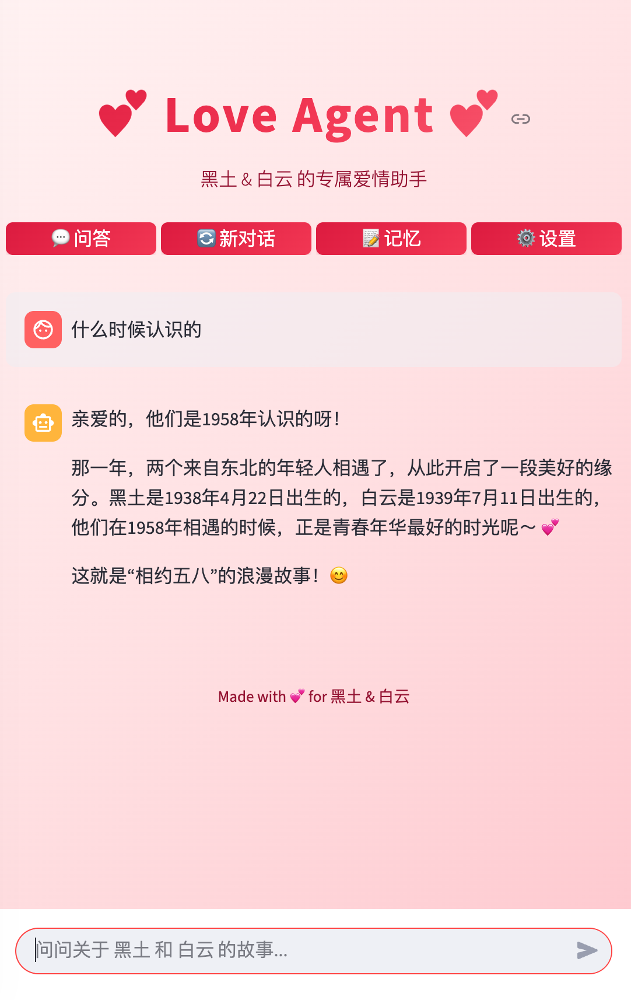
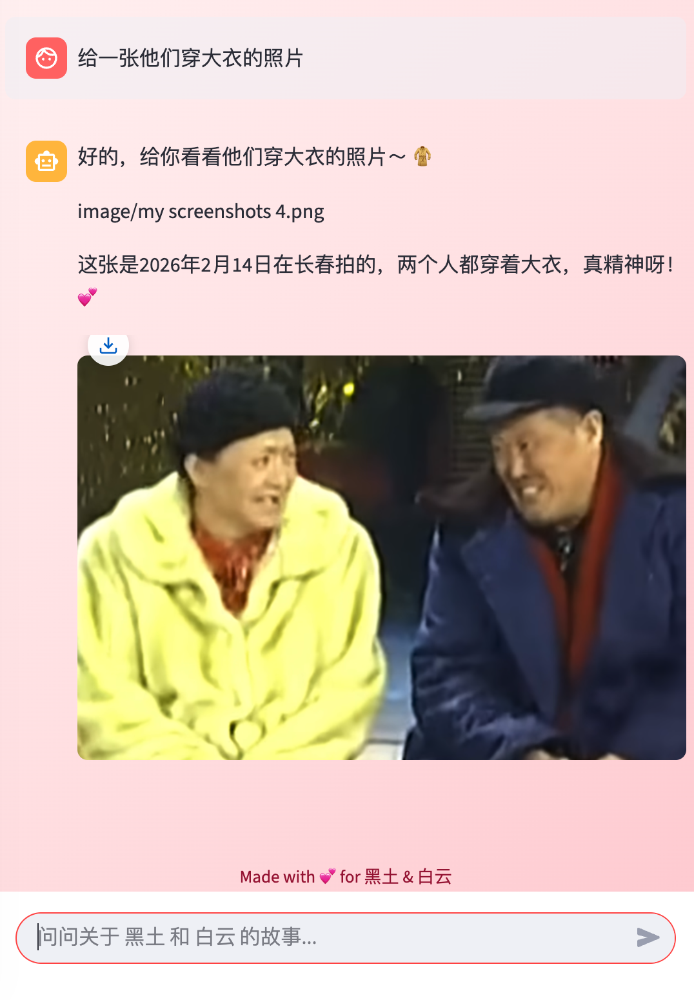
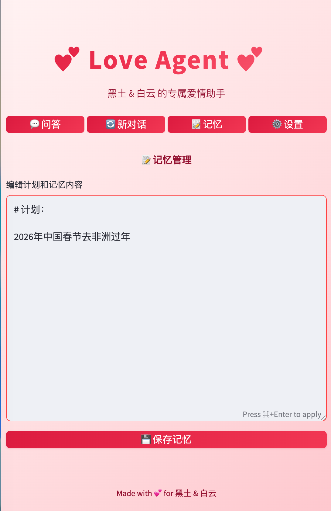
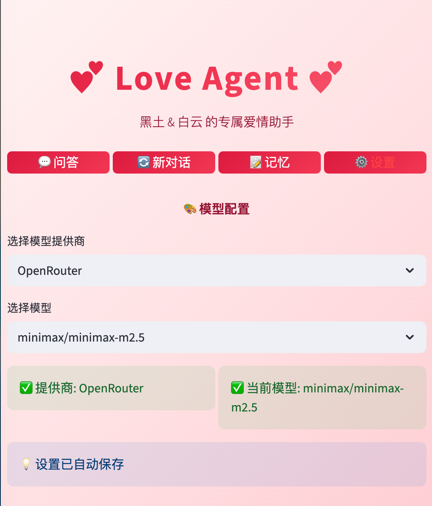

# 💝 This Valentine's Day

give your special someone a unique gift — a personalized AI agent to document your love story.


{width="500"}

# 📸 **Photo Gallery**

Export precious photos anytime, anywhere. Smart categorization with one-click export.


{width="500"}


#  **Our Memories** 
Add your unique love memories and capture every sweet moment.

{width="500"}

# 🤖 **AI Models** 

Switch between latest AI models including GLM-5,Kimi K2.5,Minimax-m2.5.

{width="500"}

# Tech stack

Python/langgraph/OpenAI SDK/Streamlit


# AI agent flow


```{mermaid}
graph TD
    %% Entry Point
    Start((User Access)) --> Login{Login Page}
    Login -- Wrong Key --> Login
    Login -- Correct Key --> Session[Init Session State]

    %% Navigation
    Session --> Tabs{Tab Selection}
    
    %% Chat Flow
    Tabs -- "💬 问答 (Chat)" --> Chat[Chat Interface]
    Chat --> UserInput[User enters Query]
    UserInput --> RunAgent[run_agent Logic]
    
    subgraph "Agent Workflow"
        RunAgent --> LoadData[Load Context]
        LoadData --> Story[Read story.md]
        LoadData --> Excel[Read data.xlsx Metadata]
        LoadData --> MemDB[Fetch Supabase Memory]
        
        Story & Excel & MemDB --> Prompt[Construct System Prompt]
        Prompt --> LLM[Call LLM - OpenAI/OpenRouter]
        LLM --> Response[Generate Response with Image Paths]
    end
    
    Response --> UIProcess[UI Processing]
    UIProcess --> Regex[Extract image/xxx.jpeg paths]
    Regex --> Strip[Remove paths from display text]
    Strip --> Render[Render Markdown + Image Gallery]
    
    %% Memory Flow
    Tabs -- "📝 记忆 (Memory)" --> MemPage[Edit Plans/Stories]
    MemPage --> SaveMem[Save to Supabase]
    SaveMem --> Session

    %% Settings Flow
    Tabs -- "⚙️ 设置 (Settings)" --> Config[Model Configuration]
    Config --> ModelSelect[Update Provider/Model]
    ModelSelect --> Session

    %% Data Sources
    subgraph "External Sources"
        Supa[(Supabase Cloud)]
        Local[(story.md / data.xlsx)]
        Images[/image folder/]
    end

    MemDB -.-> Supa
    SaveMem -.-> Supa
    Story & Excel -.-> Local
    Render -.-> Images
```

