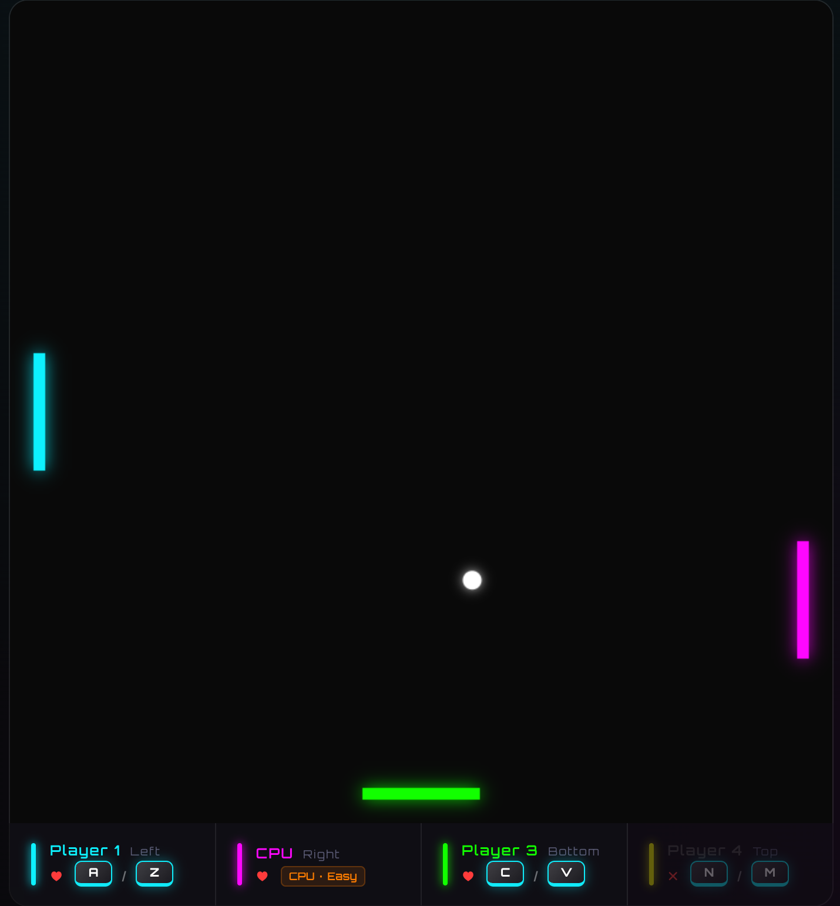

# Introduction to the game

The VibePong game is a simple yet engaging pong-style game where players can compete against each other up to 4 players or against a CPU opponent. The game features various metrics such as ball speed, game duration, and player performance, which are recorded in CSV files for analysis.

Play now :[https://jcwinning.github.io/vibepong](https://jcwinning.github.io/vibepong)

{height="500"}   {height="500"}

# game data analysis

In this document, we analyze the game data generated by VibePong. The analysis covers data ingestion, cleaning, and exploratory data analysis (EDA) with visualizations.

# Step 1: Read Data

First, we search for all summary and action,telemetry CSV files in the `game_data` directory and load them into pandas DataFrames.

```{python}
import pandas as pd
import glob
import os

# Load all CSV files from game_data
data_dir = './game_data'
def load_combined(pattern):
    files = glob.glob(os.path.join(data_dir, f'vibepong_{pattern}_*.csv'))
    return pd.concat([pd.read_csv(f) for f in files], ignore_index=True) if files else pd.DataFrame()

df_summary = load_combined('summary')
df_actions = load_combined('actions')
df_telemetry = load_combined('telemetry')

print(f"Loaded {len(df_summary)} summary rows, {len(df_actions)} actions, and {len(df_telemetry)} telemetry records.")
```

## game by game  data
```{python}
# Display the first few rows of summary data
df_summary.head()
```

## Play by Play data
```{python}
# Display the first few rows of summary data
df_actions.head()
```


## time by time data
```{python}
# Display the first few rows of summary data
df_telemetry.head()
```

# Step 2: Data Cleaning

We will clean the data by converting timestamps to datetime objects, handling numeric types, and ensuring consistency.

```{python}
# Clean Summary data
df_summary['Date'] = pd.to_datetime(df_summary['Date'])
numeric_summary = ['Duration (s)', 'Ball Speed', 'Lives', 'Hits']
df_summary[numeric_summary] = df_summary[numeric_summary].apply(pd.to_numeric, errors='coerce')
df_summary = df_summary.dropna(subset=['Player'])

# Clean Action data
df_actions['Timestamp (ms)'] = pd.to_numeric(df_actions['Timestamp (ms)'], errors='coerce')

df_summary.head()
```

# Step 3: EDA and Visualization

Now we'll look at some key performance indicators and visualize the game results.

## Win Distribution

```{python}
import seaborn as sns
import matplotlib.pyplot as plt

# Set aesthetic style
sns.set_theme(style="whitegrid")
plt.rcParams['font.sans-serif'] = ['Arial Unicode MS']
plt.rcParams['axes.unicode_minus'] = False

```

Who is winning the most games?

```{python}
# Count unique games per winner
unique_games = df_summary.drop_duplicates(subset=['Game ID'])
winner_counts = unique_games['Winner'].value_counts()

plt.figure(figsize=(10, 5))
sns.barplot(x=winner_counts.index, y=winner_counts.values, palette="viridis")
plt.title('Wins by Player/CPU', fontsize=14)
plt.show()
```

## Game Duration vs. Ball Speed

Does a higher ball speed lead to shorter games?

```{python}
plt.figure(figsize=(10, 6))
sns.scatterplot(data=unique_games, x='Ball Speed', y='Duration (s)', hue='Winner', s=100)
plt.title('Game Duration vs Ball Speed', fontsize=15)
plt.show()
```

## Total Hits per Player

Tracking the skill (hits) across different game sessions.

```{python}
plt.figure(figsize=(10, 6))
sns.boxplot(data=df_summary, x='Player', y='Hits', palette="magma")
plt.title('Distribution of Hits per Player', fontsize=15)
plt.show()
```

## Sequence of Actions

Analyzing the frequency of actions across all games.

```{python}
action_counts = df_actions['Action'].value_counts().head(10)

plt.figure(figsize=(8, 7))
action_counts.plot(kind='barh', color='skyblue')
plt.title('Most Frequent Actions/Events', fontsize=15)
plt.gca().invert_yaxis()
plt.show()
```

# Step 4: Telemetry Data Analysis

Now let's analyze the high-frequency telemetry data that captures ball and paddle positions every 100ms.


## Ball Speed Over Time

How does ball speed evolve across all games?

```{python}
if not df_telemetry.empty:
    plt.figure(figsize=(10, 5))
    for gid in df_telemetry['Game ID'].unique()[:10]:
        df_g = df_telemetry[df_telemetry['Game ID'] == gid]
        plt.plot(df_g['Timestamp (ms)']/1000, df_g['Ball Speed'], alpha=0.6, label=f'Game {gid[-4:]}')
    
    plt.title('Ball Speed Evolution (First 10 Games)')
    plt.xlabel('Time (s)')
    plt.ylabel('Speed')
    plt.legend(bbox_to_anchor=(1.05, 1), loc='upper left', fontsize=8)
    plt.tight_layout()
    plt.show()
```

## Ball Trajectory Heatmap

Where does the ball spend most of its time on the court?

```{python}
if not df_telemetry.empty:
    plt.figure(figsize=(10, 6))
    plt.hist2d(df_telemetry['Ball X'], df_telemetry['Ball Y'], bins=50, cmap='hot')
    plt.colorbar(label='Samples')
    plt.title('Ball Position Heatmap')
    plt.show()
```

## Paddle Movement Analysis

Which players move their paddles the most?

```{python}
if not df_telemetry.empty:
    dist_cols = [c for c in df_telemetry.columns if 'Distance' in c and 'Ball' not in c]
    movement = []
    for gid in df_telemetry['Game ID'].unique():
        df_g = df_telemetry[df_telemetry['Game ID'] == gid]
        for col in dist_cols:
            movement.append({'Player': col.split()[0], 'Distance': df_g[col].sum()})
    
    plt.figure(figsize=(10, 5))
    sns.boxplot(data=pd.DataFrame(movement), x='Player', y='Distance', palette='coolwarm')
    plt.title('Paddle Movement per Player')
    plt.show()
```

